# Kafka: Producer, Partition & Consumer in a Scalable Cluster

A concise reference guide covering how Apache Kafka works end-to-end — from producers writing messages to consumers reading them, with a focus on how the system scales.

---

## Architecture Overview



---

## 1. Producers

Producers write messages to a **topic**. When sending, a producer can optionally specify:

- A **partition number** directly
- A **message key** (Kafka hashes it to pick a partition)
- Nothing — let the default partitioner decide

### Key → Partition routing

```
partition = murmur2_hash(key) % numPartitions
```

The same key **always lands on the same partition**, guaranteeing ordering per key (e.g. all events for `userId=42` stay in order).

---

## 2. Topics & Partitions

A **topic** is a named stream of records. Internally it is split into **partitions** — each one an ordered, append-only log.

| Concept | Description |
|---|---|
| **Partition** | Ordered, immutable sequence of records |
| **Offset** | Unique ID of a record within a partition (starts at 0) |
| **Leader** | The broker handling all reads/writes for a partition |
| **Replica** | Copy of a partition on another broker |
| **ISR** | In-Sync Replicas — replicas fully caught up with the leader |
| **RF** | Replication Factor — how many copies exist (RF=2 means 1 leader + 1 replica) |

### Why partitions matter for scale

- More partitions → more parallel writes and reads
- Each partition lives on one broker (leader), replicas on others
- If a leader broker dies, Kafka elects a new leader from the ISR — no data loss

---

## 3. Broker Cluster

Brokers are the servers that store partition data. In a 3-broker cluster with 3 partitions and RF=2:

```
Broker 1: P0 leader,  P1 replica
Broker 2: P1 leader,  P2 replica
Broker 3: P2 leader,  P0 replica
```

Each broker handles its leader partitions for reads/writes, and silently replicates from others.

### ZooKeeper / KRaft

Kafka uses a **controller** node to manage cluster metadata:
- Which broker leads which partition
- Partition reassignment on broker failure
- Topic/config changes

> **Modern Kafka (2.8+)** replaces ZooKeeper with **KRaft** — metadata is stored inside Kafka itself using the Raft consensus algorithm, removing the external dependency.

---

## 4. What Happens When a Producer Sends Without a Partition?



Kafka checks in this order:

### Step 1 — Custom partitioner configured?
If `partitioner.class` is set, Kafka calls your code. You return a partition number. Full control.

### Step 2 — Message key present?
```
partition = murmur2_hash(key) % numPartitions
```
Same key → same partition, always. Use this whenever ordering matters.

### Step 3 — No key, no custom partitioner: Default Partitioner

| Kafka version | Strategy | Behaviour |
|---|---|---|
| < 2.4 | **Round-robin** | Each message cycles P0→P1→P2→P0… One message per batch — high overhead |
| ≥ 2.4 | **Sticky Partitioner** *(default)* | Fills a batch on one partition, switches when batch is full or `linger.ms` expires |

#### Why Sticky is better

Round-robin sent every keyless message as its own tiny batch, causing unnecessary network overhead and higher end-to-end latency. The sticky partitioner batches multiple messages together before sending, then rotates — giving **even distribution over time** with far fewer, larger batches.

Sticky switches when:
1. The current batch reaches `batch.size` bytes, **or**
2. `linger.ms` timeout fires

> Kafka's own benchmarks showed ~50% latency reduction for keyless messages after switching to the sticky partitioner in 2.4.

---

## 5. Consumer Groups

Consumers read from topics by **pulling** messages from brokers. They are organised into **consumer groups**.

### Assignment rules

- Each partition is assigned to **exactly one consumer** in a group at a time
- Multiple groups can independently read the same topic at their own pace
- Max useful parallelism = number of partitions (adding more consumers than partitions leaves some idle)

### Offset management

Consumers track their progress via **offsets**, committed to the internal topic `__consumer_offsets`:

```
Consumer 1  ←  Partition 0  (offset: 4)
Consumer 2  ←  Partition 1  (offset: 3)
Consumer 3  ←  Partition 2  (offset: 2)
```

Because offsets are stored independently per group, **any group can replay from any past offset** — unlike a traditional message queue where consumed messages are deleted.

---

## 6. Scalability Reference

| Action | Effect |
|---|---|
| ↑ Partitions | ↑ Write/read throughput (more parallelism) |
| ↑ Brokers | ↑ Storage capacity, distributes partition leaders |
| ↑ Consumers (≤ partitions) | ↑ Processing parallelism |
| RF ≥ 2 | Fault tolerance — survives broker failure |
| Long retention | Messages replayable from any offset |

---

## 7. Quick Configuration Reference

### Producer (key settings)

```properties
bootstrap.servers=broker1:9092,broker2:9092,broker3:9092
key.serializer=org.apache.kafka.common.serialization.StringSerializer
value.serializer=org.apache.kafka.common.serialization.StringSerializer
acks=all                  # wait for all ISR replicas to confirm
retries=3
batch.size=16384          # 16 KB — batch size for sticky partitioner
linger.ms=5               # wait up to 5ms to fill a batch
```

### Consumer (key settings)

```properties
bootstrap.servers=broker1:9092,broker2:9092,broker3:9092
group.id=my-consumer-group
key.deserializer=org.apache.kafka.common.serialization.StringDeserializer
value.deserializer=org.apache.kafka.common.serialization.StringDeserializer
auto.offset.reset=earliest   # start from beginning if no committed offset
enable.auto.commit=false      # commit offsets manually for reliability
```

---

## 8. Producing a Message (Java example)

```java
Properties props = new Properties();
props.put("bootstrap.servers", "localhost:9092");
props.put("key.serializer", "org.apache.kafka.common.serialization.StringSerializer");
props.put("value.serializer", "org.apache.kafka.common.serialization.StringSerializer");

KafkaProducer<String, String> producer = new KafkaProducer<>(props);

// With key — routes to consistent partition
ProducerRecord<String, String> record =
    new ProducerRecord<>("orders", "userId-42", "{\"amount\": 99.99}");

// Without key — sticky partitioner decides
ProducerRecord<String, String> record =
    new ProducerRecord<>("orders", "{\"amount\": 99.99}");

producer.send(record, (metadata, exception) -> {
    if (exception == null) {
        System.out.printf("Sent to partition %d, offset %d%n",
            metadata.partition(), metadata.offset());
    }
});
producer.close();
```

---

## 9. Consuming Messages (Java example)

```java
Properties props = new Properties();
props.put("bootstrap.servers", "localhost:9092");
props.put("group.id", "my-consumer-group");
props.put("key.deserializer", "org.apache.kafka.common.serialization.StringDeserializer");
props.put("value.deserializer", "org.apache.kafka.common.serialization.StringDeserializer");
props.put("enable.auto.commit", "false");

KafkaConsumer<String, String> consumer = new KafkaConsumer<>(props);
consumer.subscribe(List.of("orders"));

while (true) {
    ConsumerRecords<String, String> records = consumer.poll(Duration.ofMillis(100));
    for (ConsumerRecord<String, String> record : records) {
        System.out.printf("partition=%d offset=%d key=%s value=%s%n",
            record.partition(), record.offset(), record.key(), record.value());
    }
    consumer.commitSync(); // manual commit after processing
}
```

---

*Generated with reference to Kafka documentation and KIP-480 (Sticky Partitioner).*
